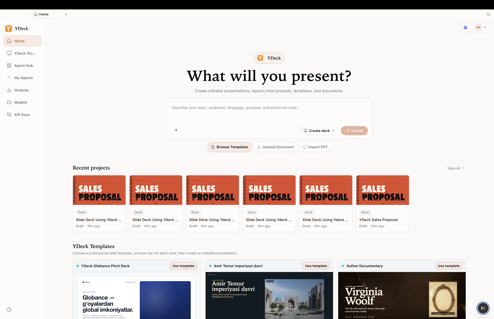

# YDeck Ecosystem

**President Tech Award Submission**

YDeck is a private AI presentation and reporting ecosystem for teams that need to turn ideas, documents, templates, and recurring business data into editable, professional presentations. The product direction combines a web workspace, a desktop application, secure device pairing, template-based deck creation, and a private reporting-agent foundation for sensitive organizational workflows.

This README is prepared specifically for President Tech Award review. It is not a public marketing README and should be treated as award-submission documentation.

## Desktop App Frontend

<p align="center">
  
</p>

The desktop interface gives users a focused workspace for creating decks, browsing templates, importing documents, managing outputs, connecting models, and working with API keys or local provider credentials.

## Mission

YDeck helps founders, educators, consultants, enterprises, and reporting teams create structured presentations faster while preserving human review and stronger privacy boundaries. The long-term product vision is to evolve from one-time slide generation into reusable company reporting memory: prior report packs, source files, KPI rules, templates, comments, and review decisions become repeatable reporting skills.

## Problem

Professional presentations and recurring management reports still require significant manual work:

- Teams rebuild similar decks and report packs every cycle.
- Sensitive files are often uploaded into generic cloud AI tools.
- Slide quality, visual consistency, and narrative structure vary by user.
- Reporting teams lose institutional memory across files, comments, and approvals.
- Executives need editable outputs, not static AI summaries.

## Solution

YDeck provides an AI-assisted workflow for creating and reviewing presentations with a privacy-first architecture:

- **Prompt-to-deck creation:** Users describe the topic, audience, language, purpose, and style.
- **Document-aware generation:** Supported files, notes, prior decks, and templates can guide the output.
- **Template library:** Users can start from approved visual structures and recurring report patterns.
- **Editable exports:** PPTX output is treated as a core workflow so teams can continue editing.
- **Desktop-first privacy path:** Local and BYOK workflows support sensitive use cases where files should stay closer to the user's device.
- **Human approval:** YDeck drafts and structures work; final business decisions remain with authorized people.

## Ecosystem Components

| Component | Purpose | Current status |
| --- | --- | --- |
| Landing and pilot intake | Explains YDeck, captures design-partner and audit interest, supports multilingual public review | Implemented in this repository |
| Authenticated web workspace | Account, workspace, billing, devices, security, templates, and desktop portal surfaces | Implemented in this repository |
| Desktop app frontend | Native-feeling creation workspace for deck generation, templates, imports, outputs, models, and API keys | Beta frontend shown above |
| Desktop pairing | Browser-approved device pairing between Desktop and YDeck Cloud API | Implemented as documented flow |
| Cloud API contracts | Auth, workspace, billing, device, pairing, bootstrap, and capability contracts for web and desktop clients | Documented and frontend-integrated |
| Reporting Skills Studio | Learns repeated reporting rules from prior packs, source data, templates, and review comments | Design-partner pilot direction |
| Private Reporting Agent | Generates reviewed recurring reports with source links, decision memory, and risk checks | Pilot/planned capability foundation |

## President Tech Award Evaluation Scope

The submission demonstrates a complete product ecosystem rather than a single landing page:

1. **Product clarity:** YDeck is positioned as a private AI presentation and recurring-reporting assistant.
2. **Working web surfaces:** The Next.js app includes public pages, waitlist intake, authentication screens, account settings, billing views, workspace views, device management, and desktop pairing flows.
3. **Desktop strategy:** The ecosystem includes a desktop app frontend and secure account-pairing contract for private/local workflows.
4. **Security-aware architecture:** Device sessions, token rotation, workspace permissions, capability resolution, and offline policy are documented.
5. **Practical output path:** The workflow focuses on editable PPTX generation and reviewed business reporting rather than autonomous publishing.

## Current Repository

This repository contains the YDeck landing and cloud workspace frontend.

| Area | Files |
| --- | --- |
| Public product site | `app/page.tsx`, `components/ydeck/*`, `app/privacy`, `app/security`, `app/terms` |
| Pilot and waitlist | `app/waitlist`, `components/WaitlistForm.tsx`, `app/api/waitlist/route.ts` |
| Auth flows | `app/auth/*`, `src/api/auth`, `src/providers/auth-provider.tsx` |
| Workspace shell | `app/workspace`, `components/workspace/*`, `src/providers/workspace-provider.tsx` |
| Account center | `app/settings/*`, `components/account/*`, account/billing/device providers |
| Desktop portal and pairing | `app/desktop/*`, `src/lib/desktop-*`, desktop integration docs |
| Tests and QA artifacts | `tests/*.test.ts`, `artifacts/*` |

## Technology Stack

- **Framework:** Next.js 16 with React 19
- **Language:** TypeScript
- **Styling:** Tailwind CSS and scoped application CSS
- **Animation:** Framer Motion
- **Icons:** Lucide React
- **Waitlist persistence:** Supabase
- **Validation:** Node test runner with `tsx`, TypeScript type checking, and Next.js build

## Local Setup

```bash
npm install
cp .env.local.example .env.local
npm run dev
```

The development server runs on:

```text
http://localhost:3005
```

Required environment variables are documented in `.env.local.example`. Local development can use the default API proxy target when paired with the YDeck backend running on `http://localhost:2026`.

## Verification Commands

```bash
npm run typecheck
npm test
npm run build
```

Use targeted tests during development, then run the broader validation commands before packaging an award or release build.

## Security and Privacy Principles

YDeck is designed for organizations that handle sensitive files and recurring reports:

- Desktop pairing is approved in the browser by an authenticated user.
- Pairing secrets and token material are never placed in browser URLs.
- Desktop refresh tokens are expected to live in OS credential storage.
- Access tokens are short-lived and revalidated against live user, device, session, and workspace state.
- Workspace permissions and entitlements are resolved by the server.
- Device revocation blocks future desktop access without deleting local user projects.
- BYOK credentials and local project state remain separate from cloud account state.
- Human review remains mandatory for final business outputs.

## Product Maturity

| Capability | Status |
| --- | --- |
| Public landing page, waitlist, legal, and security pages | Available |
| Web authentication, account profile, settings, billing, invoices, and device views | Available |
| Workspace shell and desktop portal | Available |
| Desktop secure pairing flow | Available as frontend and documented API contract |
| Local/BYOK generation foundation | Beta direction |
| Editable PPTX workflow | Beta direction |
| Evidence-linked recurring reporting skills | Design-partner pilot |
| PDF reporting, cloud asset sync, cloud project sync, agent catalog, and broader Reporting OS | Planned |

## Award Narrative

YDeck targets a real productivity and privacy gap: organizations need AI support for presentations and management reporting, but they cannot treat confidential business material as disposable chat input. The ecosystem addresses this by combining polished user-facing presentation workflows with a security-aware desktop/cloud architecture and a clear path toward reusable reporting intelligence.

For President Tech Award review, the strongest differentiators are:

- A hybrid web and desktop ecosystem rather than a single web generator.
- A privacy-first architecture that supports local and BYOK workflows.
- A practical focus on editable business outputs.
- A roadmap from presentation creation into evidence-linked recurring-report automation.
- A product interface and technical contract designed for real organizational use.

## Review Notes

This repository may contain generated QA screenshots, audit notes, and integration documents used during development. API keys, tokens, private credentials, and `.env.local` values must not be committed. Any award demo environment should use dedicated test accounts and non-sensitive sample documents.
